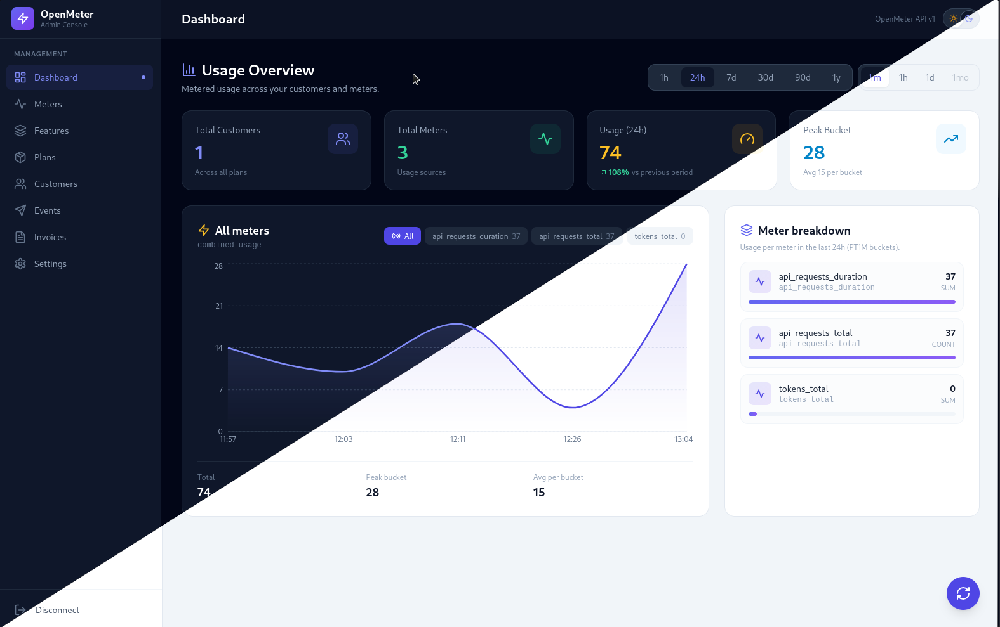

# OpenMeter Admin UI

<p align="center">
  
</p>

A React + Vite admin console for the [OpenMeter](https://openmeter.io) product catalog and billing APIs. It lets you manage meters, features, plans, customers, events, and invoices from a single dashboard.

## Quickstart

### Prerequisites

- Docker (with Compose)
- curl
- jq

### Using Make (recommended)

A `Makefile` is included at the repo root to launch OpenMeter and its dependencies:

```sh
make up     # production mode
make dev    # development mode (also starts kafka-ui and ch-ui)
make down   # stop containers (keep data)
make clean  # stop containers and remove all data/volumes
make logs   # tail logs
make status # show running services
make pull   # pull latest images
```

The same Makefile also drives the UI:

```sh
make install  # npm install
make ui       # run the UI dev server
make build    # production build
make start    # start OpenMeter (Docker) + run the UI dev server
```

Run `make help` for the full list of targets.

Clone the repository:

```sh
git clone git@github.com:openmeterio/openmeter.git
cd openmeter/quickstart
```

### 1. Launch OpenMeter

Launch OpenMeter and its dependencies via:

```bash
docker compose up -d
```

### 2. Ingest usage event(s)

Ingest usage events in [CloudEvents](https://cloudevents.io/) format:

```bash
curl -X POST http://localhost:48888/api/v1/events \
-H 'Content-Type: application/cloudevents+json' \
--data-raw '
{
  "specversion" : "1.0",
  "type": "request",
  "id": "00001",
  "time": "2026-07-07T00:00:00.001Z",
  "source": "service-0",
  "subject": "customer-1",
  "data": {
    "method": "GET",
    "route": "/hello",
    "duration_ms": 10
  }
}
'
```

Note how ID is different:

```bash
curl -X POST http://localhost:48888/api/v1/events \
-H 'Content-Type: application/cloudevents+json' \
--data-raw '
{
  "specversion" : "1.0",
  "type": "request",
  "id": "00002",
  "time": "2026-07-07T00:00:00.001Z",
  "source": "service-0",
  "subject": "customer-1",
  "data": {
    "method": "GET",
    "route": "/hello",
    "duration_ms": 20
  }
}
'
```

Note how ID and time are different:

```bash
curl -X POST http://localhost:48888/api/v1/events \
-H 'Content-Type: application/cloudevents+json' \
--data-raw '
{
  "specversion" : "1.0",
  "type": "request",
  "id": "00003",
  "time": "2026-07-08T00:00:00.001Z",
  "source": "service-0",
  "subject": "customer-1",
  "data": {
    "method": "GET",
    "route": "/hello",
    "duration_ms": 30
  }
}
'
```

### 3. Query Usage

Query the usage hourly:

```bash
curl 'http://localhost:48888/api/v1/meters/api_requests_total/query?windowSize=HOUR&groupBy=method&groupBy=route' | jq
```

```json
{
  "windowSize": "HOUR",
  "data": [
    {
      "value": 2,
      "windowStart": "2026-07-07T00:00:00Z",
      "windowEnd": "2026-07-07T01:00:00Z",
      "subject": null,
      "groupBy": {
        "method": "GET",
        "route": "/hello"
      }
    },
    {
      "value": 1,
      "windowStart": "2026-07-08T00:00:00Z",
      "windowEnd": "2026-07-08T01:00:00Z",
      "subject": null,
      "groupBy": {
        "method": "GET",
        "route": "/hello"
      }
    }
  ]
}
```

Query the total usage for `customer-1`:

```bash
curl 'http://localhost:48888/api/v1/meters/api_requests_total/query?subject=customer-1' | jq
```

```json
{
  "data": [
    {
      "value": 3,
      "windowStart": "2026-07-07T00:00:00Z",
      "windowEnd": "2026-07-08T00:01:00Z",
      "subject": "customer-1",
      "groupBy": {}
    }
  ]
}
```

### 4. Configure additional meter(s) _(optional)_

In this example we will meter LLM token usage, grouped by AI model and prompt type.
You can think about it how OpenAI [charges](https://openai.com/pricing) by tokens for ChatGPT.

Configure how OpenMeter should process your usage events in this new `tokens_total` meter:

```yaml
# ...

meters:
  # Sample meter to count LLM Token Usage
  - slug: tokens_total
    description: AI Token Usage
    eventType: prompt               # Filter events by type
    aggregation: SUM
    valueProperty: $.tokens         # JSONPath to parse usage value
    groupBy:
      model: $.model                # AI model used: gpt4-turbo, etc.
      type: $.type                  # Prompt type: input, output, system
```

### Cleanup

Once you are done, stop any running instances:

```bash
docker compose down -v
```

---

## Features

- **Product Catalog** — create, list, and archive features (features are immutable after creation, per the [OpenMeter docs](https://openmeter.io/docs/product-catalog/feature); archiving maps to `DELETE /v1/features/{id}`).
- **Meters** — view and filter usage meters.
- **Customers, Plans, Events, Invoices** — manage the rest of the product catalog surface.
- **Dark / Light theme** — toggle persisted in `localStorage` (`openmeter_theme`), respects `prefers-color-scheme` by default.

## Tech Stack

- [React 18](https://react.dev) + [Vite](https://vitejs.dev)
- [React Router](https://reactrouter.com) (v6)
- [Tailwind CSS](https://tailwindcss.com) with `darkMode: 'class'`
- [Recharts](https://recharts.org) for usage charts
- [lucide-react](https://lucide.dev) icons
- [Axios](https://axios-http.com) for the API client

## Getting Started

### Prerequisites

- Node.js 18+
- A running OpenMeter instance (the dev proxy targets `http://localhost:48888` by default, or set a custom one, see below).

### Install & run

```bash
npm install
npm run dev
```

By default Vite runs on `http://localhost:3000` and proxies `/api` to `http://localhost:48888`. To point at another OpenMeter instance, create a `.env`:

```bash
# Any target (proxy rewrites /api -> /api/v3 unless path is already versioned)
API_PROXY_TARGET=http://localhost:48888

# Optional override for the axios base URL (bypasses the Vite proxy).
# Leave unset to use the relative /api proxy.
# VITE_API_BASE_URL=https://openmeter.cloud/api
```

Open the app, enter your OpenMeter API key on the dashboard, and click **Connect**. Your API key is stored locally in your browser.

### Production build

```bash
npm run build
npm run preview   # serves the built app on :4173
```

## Project Layout

```
src/
  api/openmeter.js       # Axios client + endpoints against the OpenMeter v1 API
  components/            # Page components (Dashboard, Meters, Features, ...)
  context/ThemeContext.jsx  # Dark/light theme state provider
  hooks/useConfirm.jsx   # Reusable confirm dialog hook
  utils/                 # Shared helpers
index.html               # Entry HTML + no-flash theme script
vite.config.js           # Dev/preview proxy to the OpenMeter backend
```

## Theme

Toggling is handled by `ThemeContext` (adds/removes the `dark` class on `<html>`) plus a no-flash inline script in `index.html`. The current selection is saved under `openmeter_theme` in `localStorage`; the system preference is used when nothing is saved yet.

## Notes on Feature CRUD

Per the OpenMeter v1 API, features have **no update endpoint** — a feature's `key` is assigned at creation and is immutable. The UI therefore provides **create**, **list** (with an "Archived" toggle), and **archive** (delete). To change a feature, archive it and create a new one.